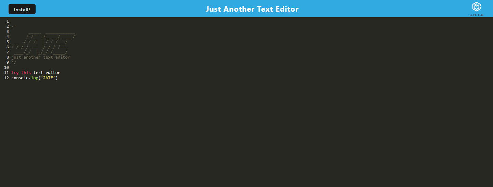
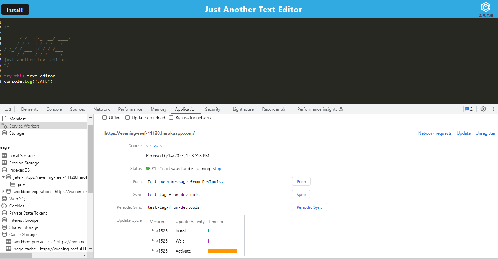
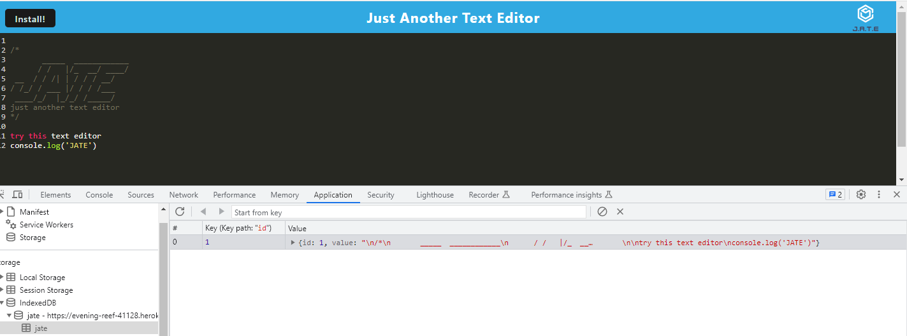

# Text-Editor

## Description

This text editor is a PWA that runs on the browser with an option to function offline. The data entered persists in the application using an IndexedDB database. Finally, the app can be installed locally by clicking on the 'Install' button.

## Table of Contents

- [Installation](#installation)
- [Usage](#usage)
- [Credits](#credits)
- [License](#license)

## Installation

To application runs in the browser. 
To run locally:
- Clone the repository
- Install required packages: `npm i`.
- Create the bundle: `npm build`.
- Run the app: `npm run start:dev`.
- Run in the browser: `localhost:3000`.

## Usage

The link to access the deployed application is *[here](https://evening-reef-41128.herokuapp.com)*. 
To install the app from the browser, click on Install button. An icon will be created on your desktop to easily access the application.

The website looks like the following image:

Service Worker and Database:

## Credits

- Starter code provided by GA Tech Bootcamp.

- PWA Module mini-project used as reference.

- Tutor: Vinnie Lopez (assistance with data base).

- Instructor: Saurav Khatiwada

## License

This Project is covered by the MIT License.